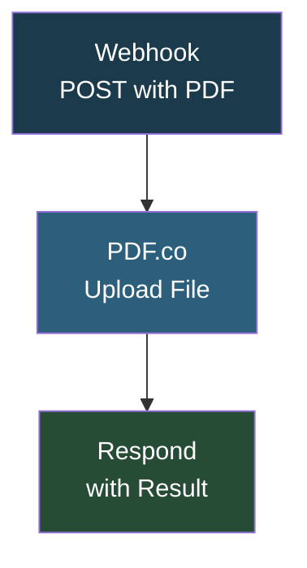

# Resume Reader v2

## Overview

A webhook-based resume file upload endpoint that receives a PDF file via POST, uploads it to PDF.co for processing, and returns the result. This is a simplified version of the resume reading pipeline that handles the file upload step via webhook and PDF.co API.

## How It Works

```
Webhook (POST with PDF file) -> PDF.co (upload file) -> Respond with upload result
```

### Workflow Diagram



## Integrations

- **PDF.co** - PDF file upload and processing

## Setup

1. Import `Resume_Reader_v2.json` into your n8n instance.
2. Update the PDF.co API key.
3. Activate the workflow and send POST requests with PDF files.
